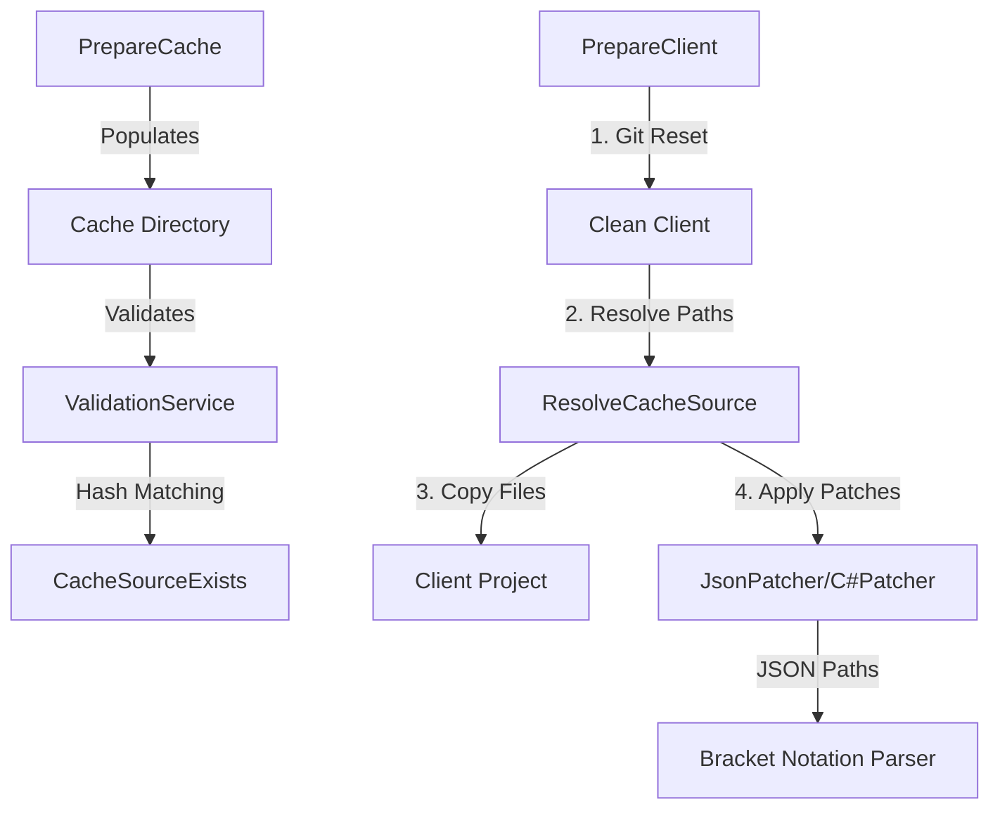

# Build Preparation Injection System

## Executive Summary

Hash-tolerant package injection system with robust JSON patching for Unity client builds. Automatically handles Unity's PackageCache hash suffixes, uses structure-aware JSON manipulation, and ensures clean build state through git reset.

**Status**: ✅ Production Ready

## Quick Start

### Full Build with Injection

```bash
task build:prepare:client CONFIG=injection
```

### Individual Operations

```bash
# Populate cache only (safe, no client modification)
task build:prepare:cache CONFIG=injection

# Inject to client (includes automatic git reset)
task build:prepare:client CONFIG=injection

# Validate configuration
task build:prepare:validate CONFIG=injection
```

## Implementation Details

### 1. Hash-Tolerant Package Matching

Unity's PackageCache stores packages with hash suffixes (e.g., `com.cysharp.unitask@15a4a7657f99`). Our system automatically matches clean package names to their hashed counterparts.

#### Modified Files

##### PrepareCommandHandler.cs

- Added `CacheSourceExists()` method
- Validates cache package existence with hash tolerance
- Matches `com.cysharp.unitask` → `com.cysharp.unitask@15a4a7657f99`

##### ValidationService.cs

- Added `CacheSourceExists()` method
- File validation with hash suffix support
- Prevents false validation errors

##### PreparationService.cs

- Added `ResolveCacheSource()` method
- Source path resolution with hash tolerance
- Enables copying packages regardless of hash suffix

#### Algorithm

```csharp
private string ResolveCacheSource(string sourcePath)
{
    // 1. Try exact match first
    // 2. Extract parent directory and package base name
    // 3. Find directories matching: baseName or baseName@hash
    // 4. Return first match or original path
}
```

### 2. JSON Patching Enhancement

Enhanced JsonPatcher to handle property names containing dots (common in package identifiers).

##### JsonPatcher.cs

- Enhanced `ParseJsonPath()` method
- Supports bracket notation: `dependencies['com.cysharp.unitask']`
- Supports quoted strings: `dependencies["com.cysharp.unitask"]`
- Maintains backward compatibility with dot notation
- Safe, structure-aware manipulation vs brittle text replacement

#### Supported Syntax

```json
// Bracket notation with single quotes (recommended for dots)
"search": "dependencies['com.cysharp.unitask']"

// Bracket notation with double quotes (also supported)
"search": "dependencies[\"com.github-glitchenzo.nugetforunity\"]"

// Traditional dot notation (for simple properties)
"search": "settings.enableFeature"
```

### 3. Build Process Integration

Git reset integration at three points in **Build.Preparation.cs** (Nuke Build Component):

- **Line 67**: `PrepareClient` target - resets before injection
- **Line 100**: `RestoreClient` target - manual cleanup
- **Line 145**: `BuildUnityWithPreparation` target - post-build restoration

#### Two-Phase Workflow

1. **PrepareCache**: Populate cache from code-quality project (safe, no client changes)
2. **PrepareClient**: Reset client → Inject from cache (build-time only)

Ensures consistent, predictable builds per R-BLD-060.

### 4. Configuration Updates

#### injection.json

- Updated code patches to use bracket notation
- Replaced text search with JSON path expressions
- Enables robust, structure-aware patching

## Results

### Injection Statistics

- ✅ **73 packages** → `projects/client/Packages/`
- ✅ **27 assemblies** → `projects/client/Assets/Plugins/`
- ✅ **3 code patches** successfully applied
  - 2 JSON patches (manifest.json - removed git dependencies)
  - 1 C# patch (Startup.cs - removed MessagePack initialization)

### Key Achievements

#### No Manual Hash Management

- Config files use clean package names (no `@hash` suffixes)
- Tool automatically matches cached folders with hash suffixes
- Zero maintenance burden for hash values

#### Safe JSON Patching

- JsonPatcher with proper path syntax
- Structure-aware manipulation (not text replacement)
- Correctly handles property names with dots

#### Clean Build Process

- Git reset ensures consistent starting state
- No residual files from previous builds
- Predictable, repeatable results

## Best Practices

1. **Always use bracket notation** for JSON properties containing dots
   - ✅ `dependencies['com.cysharp.unitask']`
   - ❌ `dependencies.com.cysharp.unitask` (incorrectly parsed)

2. **Use clean package names** in config (no hash suffixes)
   - ✅ `com.cysharp.unitask`
   - ❌ `com.cysharp.unitask@15a4a7657f99` (unnecessary)

3. **Let build system handle git operations**
   - Build automatically resets client before injection
   - Don't manually reset client project

4. **Choose appropriate patcher**
   - JSON patcher → Structured data (manifest.json, config files)
   - C# patcher → Code modifications (source files)

5. **Mark optional patches** if target might not exist
   - Prevents build failures for conditional modifications

## Troubleshooting

### Packages Not Found Despite Being in Cache

**Cause**: Cache folders have hash suffixes  
**Status**: ✅ Fixed - automatic matching implemented

### JSON Patch Doesn't Apply

**Cause**: Property name contains dots, incorrectly split by parser  
**Status**: ✅ Fixed - use bracket notation: `dependencies['package.name']`

### Previous Injection Files Interfere

**Cause**: Client not reset before injection  
**Status**: ✅ Fixed - build runs `git reset --hard` automatically

## Modified Files

### C# Tool (4 files)

```text
packages/scoped-6571/com.contractwork.sangocard.build/dotnet~/tool/SangoCard.Build.Tool/
├── PrepareCommandHandler.cs    # Cache validation
├── ValidationService.cs         # File validation
├── PreparationService.cs        # Source resolution
└── JsonPatcher.cs               # JSON path parsing
```

### Configuration (1 file)

```text
build/preparation/configs/
└── injection.json               # Updated code patches
```

### Build Component (verified)

```text
build/nuke/build/
└── Build.Preparation.cs         # Git reset integration (lines 67, 100, 145)
```

## Architecture



## Summary

The injection system is **production-ready** with:

- ✅ **Robust**: Handles Unity PackageCache hash suffixes automatically
- ✅ **Safe**: Structure-aware JSON patching (no text manipulation)
- ✅ **Clean**: Git reset ensures consistent build state
- ✅ **Maintainable**: No manual hash values in configurations
- ✅ **Validated**: Three-point git reset integration verified

**Compliance**: R-BLD-060, R-CODE-010
